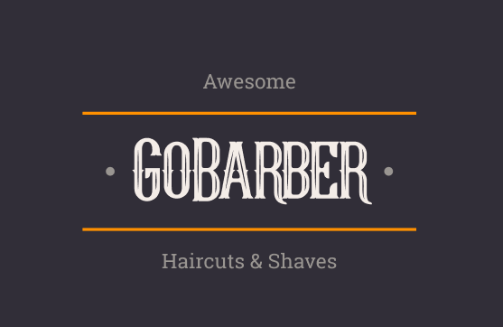
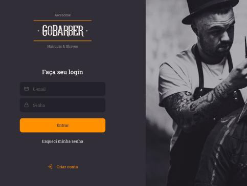
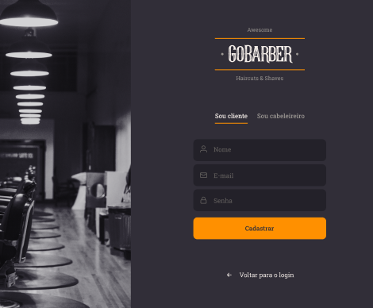

<h1 align="center">
    
</h1>

<h4 align="center">
   :scissors: Projeto de Barber para o cliente e profissional
</h4>
 
<h4/>
<p align="center">
  
<p/>


## :bulb: Instalação

Abaixe o projeto com 
```shell
git clone https://github.com/Crazy-Code-Machine/gobarber.git # HTTPS
ou
git clone git@github.com:Crazy-Code-Machine/gobarber.git # SSH

```
## :rocket: Executando projeto

Entre da pasta do projeto`cd gobarber/`


`$ yarn dev` para subir na porta 3333 a api.

`$ yarn start` para subir na porta 3000 o front.

> Para mais informações verifique o `package.json`

## :framed_picture: Imagens

<br/>
<p align="center">
  <strong>Tela de Login</strong>
<p/>

<p align="center">
  
</p>

<br/>
<p align="center">
  <strong>Tela de Cadastro</strong>
<p/>
<p align="center">
  
</p>
